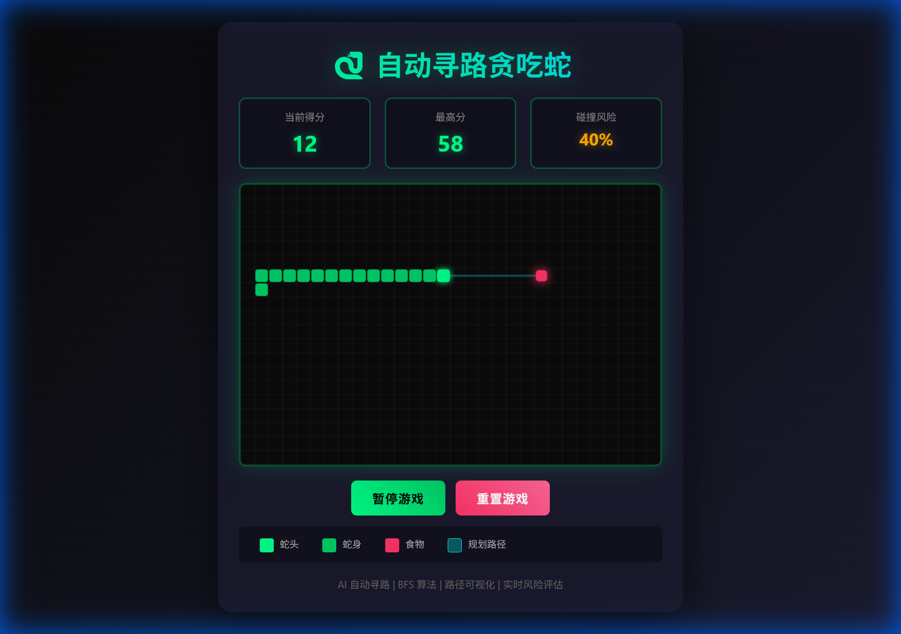

# 🎮 Project AI Games

一个基于 AI 算法的 Web 游戏合集项目,使用原生 HTML5、CSS3 和 JavaScript 开发,无需任何第三方依赖。每个游戏都是一个独立的单文件应用,展示了不同的 AI 算法和游戏机制。


## 📋 项目简介

本项目旨在通过游戏的形式展示各种 AI 算法的实际应用,包括路径规划、决策树、机器学习等。所有游戏都采用现代化的 UI 设计,提供流畅的游戏体验和直观的算法可视化。

**项目特点**:
- ✅ 纯原生开发,无第三方依赖
- ✅ 单文件应用,易于部署和分享
- ✅ 算法可视化,直观展示 AI 思考过程
- ✅ 响应式设计,支持多种设备
- ✅ 详细注释,便于学习和理解

## 🎯 游戏列表

### 1. 🐍 AI Snake - 自动寻路贪吃蛇

<div align="center">
  
</div>

**算法**: BFS 广度优先搜索 + 安全性验证 + 风险评估

**特性**:
- 🤖 智能寻路系统,自动规划最优路径
- 📊 实时碰撞风险评估(0-100%)
- 🎨 路径可视化,展示 AI 思考过程
- ⚡ 四层决策策略,确保高存活率
- 🎯 动态风险提示,根据危险程度变色

**在线演示**: [点击这里](https://houtx.github.io/Project-Ai-Games/auto-snake/) | **详细文档**: [README](./auto-snake/README.md)

**技术亮点**:
- BFS 算法实现最短路径搜索
- 模拟预测确保安全性
- 综合风险评估系统
- 缓冲机制避免陷阱

---

## 🚀 快速开始

### 在线体验

1. 克隆本仓库:
```bash
git clone https://github.com/Houtx/Project-Ai-Games.git
cd Project-Ai-Games
```

2. 选择一个游戏,在浏览器中打开对应的 `index.html` 文件:
```bash
# Windows
start auto-snake/index.html

# macOS
open auto-snake/index.html

# Linux
xdg-open auto-snake/index.html
```

### 部署到 GitHub Pages

1. Fork 本仓库
2. 在仓库设置中启用 GitHub Pages
3. 选择 `main` 分支作为源
4. 访问 `https://houtx.github.io/Project-Ai-Games/auto-snake/` 即可在线游玩

## 📁 项目结构

```
Project-Ai-Games/
├── README.md                 # 项目总说明文档
├── auto-snake/              # AI 自动寻路贪吃蛇
│   ├── index.html           # 游戏主文件
│   ├── screenshots/         # 游戏截图
│   │   ├── game_initial.png
│   │   └── game_running.png
│   └── README.md           # 游戏详细文档
└── [更多游戏项目...]
```

每个游戏项目都是独立的,包含:
- `index.html` - 完整的游戏代码(HTML + CSS + JavaScript)
- `screenshots/` - 游戏预览截图
- `README.md` - 游戏详细说明文档

## 🛠️ 技术栈

- **HTML5 Canvas** - 游戏渲染和图形绘制
- **原生 JavaScript (ES6+)** - 游戏逻辑和 AI 算法
- **CSS3** - 现代化 UI 设计和动画效果
- **LocalStorage** - 数据持久化

**无需任何构建工具或第三方库!**

## 🎨 设计理念

所有游戏都遵循统一的设计风格:

- **深色科技风格**: 深色背景 + 霓虹色彩
- **渐变效果**: 使用 CSS 渐变增强视觉效果
- **发光动画**: 关键元素添加发光效果
- **圆角设计**: 柔和的圆角矩形
- **响应式布局**: 适配不同屏幕尺寸

## 📊 算法展示

本项目中使用的 AI 算法:

| 算法 | 应用游戏 | 复杂度 | 说明 |
|------|---------|--------|------|
| BFS (广度优先搜索) | AI Snake | O(V+E) | 最短路径搜索 |
| 安全性验证 | AI Snake | O(V+E) | 预测模拟 |
| 风险评估 | AI Snake | O(1) | 综合多因素计算 |

## 🔮 未来计划

- [ ] **AI 五子棋** - Minimax 算法 + Alpha-Beta 剪枝
- [ ] **AI 扫雷** - 概率计算 + 逻辑推理
- [ ] **AI 俄罗斯方块** - 遗传算法优化
- [ ] **AI 2048** - 期望值搜索
- [ ] **AI 迷宫生成器** - DFS + 随机化算法
- [ ] **AI 推箱子** - A* 寻路算法
- [ ] **AI 跳棋** - 蒙特卡洛树搜索

## 💡 学习资源

每个游戏项目都包含:
- 📖 详细的算法说明
- 💻 完整的代码注释
- 🎯 核心逻辑讲解
- 📊 性能分析
- 🎨 可视化演示

适合:
- 学习 AI 算法的初学者
- 研究游戏 AI 的开发者
- 准备算法面试的求职者
- 对 Web 游戏开发感兴趣的爱好者

## 🤝 贡献指南

欢迎贡献新的游戏项目或改进现有游戏!

### 贡献步骤:

1. Fork 本仓库
2. 创建新的游戏文件夹 `your-game/`
3. 开发游戏并添加 README.md
4. 在项目根目录的 README.md 中添加游戏介绍
5. 提交 Pull Request

### 游戏要求:

- ✅ 必须是单文件 HTML 应用
- ✅ 不使用第三方库(纯原生开发)
- ✅ 包含 AI 算法或智能机制
- ✅ 提供详细的 README 文档
- ✅ 包含游戏截图
- ✅ 代码注释完善

## 📝 许可证

本项目采用 MIT 许可证 - 详见 [LICENSE](LICENSE) 文件

## 🌟 Star History

如果这个项目对你有帮助,请给个 Star ⭐️ 支持一下!

## 📧 联系方式

- 提交 Issue: [GitHub Issues](https://github.com/Houtx/Project-Ai-Games/issues)
- 发起讨论: [GitHub Discussions](https://github.com/Houtx/Project-Ai-Games/discussions)

## 🎯 项目目标

通过这个项目,我希望:
1. 📚 帮助更多人理解 AI 算法的实际应用
2. 🎮 展示如何用原生 JavaScript 开发高质量游戏
3. 💡 激发对算法和游戏开发的兴趣
4. 🌍 构建一个开源的 AI 游戏学习平台

---

<div align="center">
  <p><strong>享受 AI 游戏的乐趣,探索算法的魅力!</strong> 🎮✨</p>
  <p>Made with ❤️ by AI Game Developers</p>
</div>