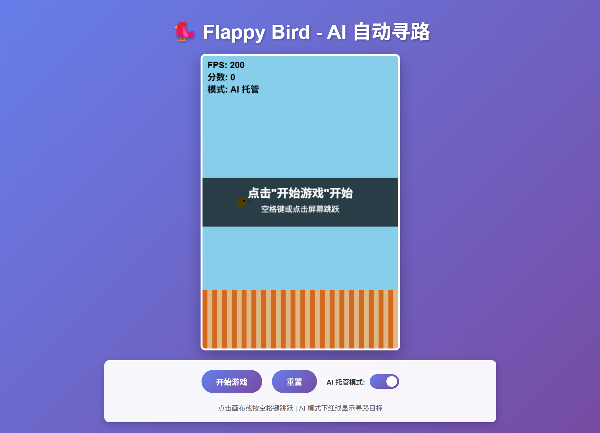
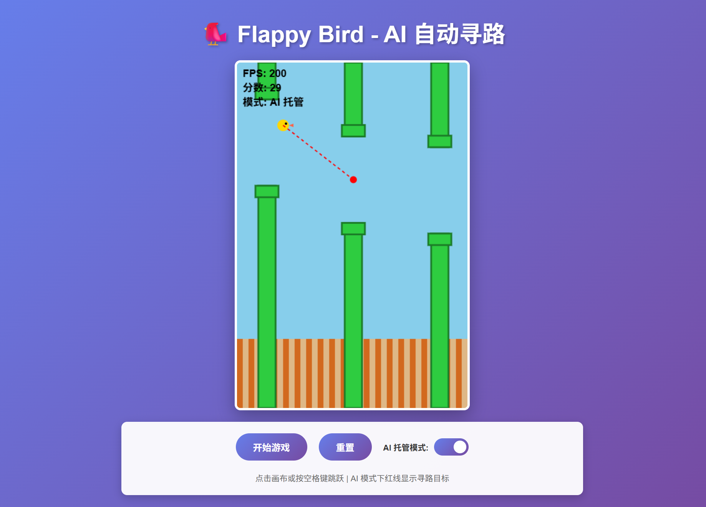

# 🐦 Flappy Bird - AI 自动寻路版

<div align="center">
  
  
</div>

一个经典的 Flappy Bird 游戏，集成了智能 AI 自动寻路系统。支持手动游玩和 AI 托管两种模式，可以实时切换体验不同的游戏方式。

## ✨ 项目特色

- 🎮 **双模式游玩**：手动模式和 AI 托管模式自由切换
- 🤖 **智能 AI**：基于预判的贪婪算法，自动避开障碍物
- 👁️ **可视化寻路**：红色辅助线实时显示 AI 的决策过程
- ⚙️ **参数可调**：所有游戏参数都可以自定义调整
- 🎨 **美观界面**：现代化渐变设计，流畅动画效果
- 📦 **单文件应用**：无需安装依赖，直接在浏览器中运行

## 🚀 快速开始

1. 直接在浏览器中打开 `index.html` 文件
2. 点击"开始游戏"按钮
3. 点击画布或按空格键控制小鸟跳跃
4. 勾选"AI 托管模式"即可观看 AI 自动游玩

## 🎮 操作说明

### 手动模式
- **点击画布**：让小鸟跳跃
- **空格键**：让小鸟跳跃
- **开始游戏**：启动游戏
- **重置**：重新开始

### AI 模式
- 勾选"AI 托管模式"开关
- AI 会自动控制小鸟避开障碍
- 红色虚线显示 AI 的目标路径
- 红色圆点标记目标管道空隙中心

## 📊 游戏参数说明

游戏的所有核心参数都在 `index.html` 文件的 `CONFIG` 对象中（约第 166-174 行），您可以根据需要自由调整：

```javascript
const CONFIG = {
    gravity: 0.2,        // 重力加速度 - 控制下坠速度
    jumpVelocity: -2.5,  // 跳跃初速度 - 控制跳跃高度
    pipeWidth: 30,       // 管道宽度
    pipeGap: 150,        // 上下管道间的空隙高度
    pipeSpeed: 1,        // 管道移动速度
    pipeInterval: 150,   // 管道生成间隔（帧数）
    birdSize: 20,        // 小鸟大小
    birdX: 80,           // 小鸟的水平位置
};
```

### 参数调整建议

**调整难度：**
- **降低难度**：增加 `pipeGap`（如 180）、增加 `pipeInterval`（如 200）、减小 `pipeSpeed`（如 0.5）
- **提高难度**：减小 `pipeGap`（如 120）、减小 `pipeInterval`（如 90）、增加 `pipeSpeed`（如 2）

**调整手感：**
- **下坠太快**：减小 `gravity`（如 0.1）
- **跳得太高**：减小 `jumpVelocity` 的绝对值（如 -1.5）
- **跳得太低**：增加 `jumpVelocity` 的绝对值（如 -3）

**管道密度：**
- **管道太密**：增加 `pipeInterval`（如 150-200）
- **管道太稀**：减小 `pipeInterval`（如 70-90）

## 🤖 AI 算法说明

本项目使用的是**基于预判的贪婪算法**：

1. **目标定位**：实时锁定最近的未通过管道
2. **轨迹预判**：计算小鸟未来 8 帧的飞行位置
3. **智能决策**：
   - 如果预测位置低于目标空隙中心，则跳跃
   - 避免过度跳跃，保持平滑飞行
4. **安全机制**：游戏开始时自动保持在安全高度

该算法简单高效，能在大多数情况下成功通过障碍，但不追求 100% 完美通过率。

## 📁 文件结构

```
auto-flappy-bird/
├── index.html           # 游戏主文件（包含所有 HTML/CSS/JavaScript）
├── screenshots/         # 游戏截图
│   ├── game_initial.png # 游戏初始界面
│   └── game_running.png # 游戏运行界面
└── README.md           # 项目说明文档
```

## 🎯 功能特性

### ✅ 已实现功能

- [x] 完整的 Flappy Bird 游戏机制
- [x] 物理引擎（重力、跳跃、速度）
- [x] 碰撞检测系统
- [x] 管道自动生成和移动
- [x] 计分系统
- [x] AI 自动寻路算法
- [x] 手动/AI 模式无缝切换
- [x] 可视化辅助线
- [x] FPS 实时显示
- [x] 游戏状态管理（准备/进行/结束）
- [x] 响应式控制面板

## 🛠️ 技术栈

- **HTML5**：页面结构
- **CSS3**：现代化样式设计
- **JavaScript (ES6+)**：游戏逻辑
- **Canvas API**：游戏渲染

**无第三方依赖**，纯原生代码实现。

## 💡 使用建议

1. **首次游玩**：建议先尝试手动模式，熟悉游戏机制
2. **观看 AI**：切换到 AI 模式，观察红色辅助线理解 AI 决策
3. **调整参数**：根据个人喜好调整 CONFIG 参数，找到最舒适的游戏体验
4. **性能优化**：游戏稳定运行在 60 FPS，无需特殊优化

## 🎨 界面预览

- 渐变紫色背景
- 天蓝色天空 + 土黄色地面
- 绿色管道 + 金色小鸟
- 白色半透明控制面板
- 红色 AI 可视化辅助线

## 📝 开发说明

本项目基于以下需求开发：

1. Web 原生技术栈（HTML/CSS/JavaScript）
2. Canvas 渲染引擎
3. 单文件架构便于部署
4. AI 寻路算法集成
5. 实时可视化系统
6. 友好的用户界面

## 🔧 自定义开发

如果您想进一步定制游戏，可以修改以下部分：

- **视觉样式**：修改 `<style>` 标签内的 CSS
- **游戏参数**：修改 `CONFIG` 对象
- **AI 算法**：修改 `aiDecision()` 函数（约第 318 行）
- **画面元素**：修改 `draw()` 和相关绘制函数

## 📄 许可证

本项目仅供学习和研究使用。

## 🙏 致谢

感谢经典的 Flappy Bird 游戏带来的灵感！

---

**Enjoy the Game! 🎮**