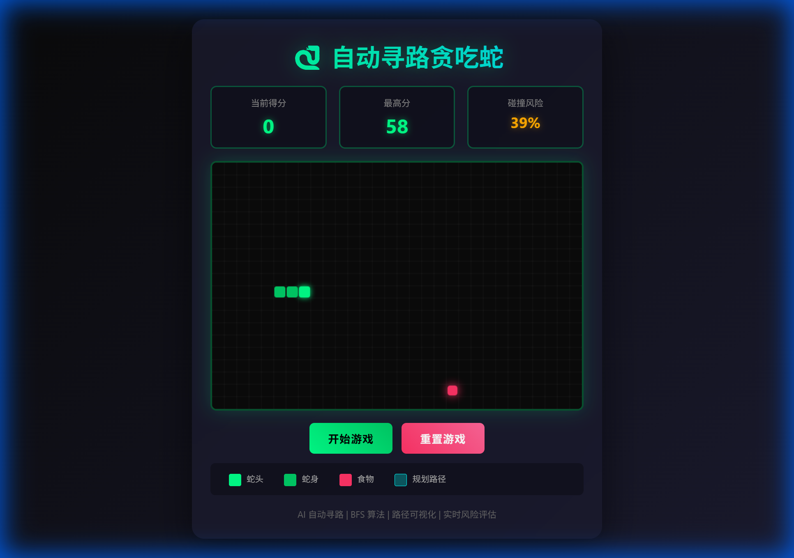
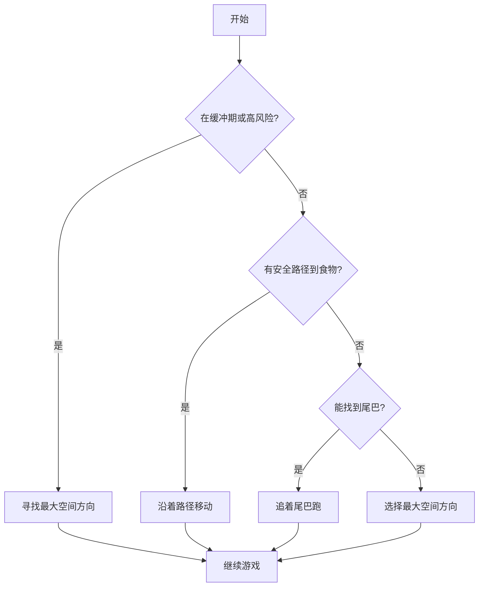

# 🐍 AI Snake - 自动寻路贪吃蛇

一个基于 HTML5 Canvas 和原生 JavaScript 开发的智能贪吃蛇游戏,采用 BFS 广度优先搜索算法实现自动寻路,支持实时路径可视化和碰撞风险评估。


## 📸 游戏预览

### 游戏界面
<div align="center">
  
  <p><i>游戏初始界面 - 深色科技风格设计,显示碰撞风险评估</i></p>
</div>

### 运行中(路径可视化)
<div align="center">
  
  <p><i>游戏运行中 - 青色线条显示 AI 的规划路径,实时显示碰撞风险</i></p>
</div>

## ✨ 功能特性

### 🤖 智能寻路系统
- **BFS 算法**:使用广度优先搜索计算从蛇头到食物的最短路径
- **安全性验证**:模拟吃掉食物后的状态,确保有出路,避免走入死路
- **追尾策略**:当无法安全到达食物时,自动追着尾巴跑,延长生存时间
- **智能决策**:选择能够访问最大空间的方向作为备用策略
- **缓冲机制**:吃食物后进入缓冲期,优先寻找空旷区域

### 🎮 游戏功能
- 经典贪吃蛇玩法(吃食物变长,碰撞结束)
- 流畅的游戏循环(120ms 刷新间隔)
- 得分系统和最高分记录(LocalStorage 持久化)
- 开始/暂停/重置游戏控制
- **实时碰撞风险评估**:动态显示当前碰撞概率(0-100%)
- **智能风险提示**:根据风险等级自动变色(绿色/橙色/红色)
- **高风险警告**:风险≥70%时触发脉冲动画

### 🎨 视觉效果
- **深色科技风格**:渐变背景和半透明容器
- **实时路径可视化**:青色半透明线条显示 AI 的思考路线
- **蛇头发光效果**:亮绿色蛇头带发光动画
- **食物脉动动画**:红色食物带呼吸效果
- **圆角设计**:蛇身采用圆角矩形渲染
- **动态风险指示器**:根据风险等级实时变色和动画

## 🚀 快速开始

### 在线演示
直接在浏览器中打开 `index.html` 文件即可开始游戏。

### 本地运行
```bash
# 克隆仓库
git clone https://github.com/your-username/auto-snake.git

# 进入项目目录
cd auto-snake

# 在浏览器中打开 index.html
# Windows
start index.html

# macOS
open index.html

# Linux
xdg-open index.html
```

无需安装任何依赖,直接在现代浏览器中运行!

## 🎯 使用说明

1. **开始游戏**:点击"开始游戏"按钮,蛇会自动开始寻路
2. **观察路径**:青色半透明线条显示 AI 规划的路径
3. **监控风险**:实时查看碰撞风险百分比和颜色提示
4. **暂停/继续**:点击"暂停游戏"可以暂停,再次点击继续
5. **重置游戏**:点击"重置游戏"重新开始

## 🧠 核心算法

### BFS 寻路算法
使用队列实现的广度优先搜索,找到从蛇头到食物的最短路径:

```javascript
function findPathBFS(start, target, obstacles) {
    const queue = [[start]];
    const visited = new Set();
    
    while (queue.length > 0) {
        const path = queue.shift();
        const current = path[path.length - 1];
        
        if (current.x === target.x && current.y === target.y) {
            return path; // 找到目标
        }
        
        // 探索四个方向...
    }
    
    return null; // 无路径
}
```

### 碰撞风险评估算法

实时计算碰撞概率,综合考虑多个因素:

```javascript
function calculateCollisionRisk() {
    // 1. 被阻挡方向 (40%)
    risk += (blockedDirections / 4) * 40;
    
    // 2. 可达空间 (30%)
    risk += (1 - spaceRatio) * 30;
    
    // 3. 蛇身长度 (20%)
    risk += lengthRatio * 20;
    
    // 4. 靠近墙壁 (10%)
    risk += (nearWallCount / 4) * 10;
    
    return Math.round(risk); // 0-100
}
```

**风险因素权重**:
- **被阻挡方向(40分)**: 检查四周可移动方向数量
- **可达空间(30分)**: 使用BFS计算可达格子数量
- **蛇身长度(20分)**: 蛇越长,活动空间越小
- **靠近墙壁(10分)**: 检测周围墙壁数量

### 四层决策策略



1. **优先级 0**: 缓冲期或高风险时寻找最大空间(避免陷阱)
2. **优先级 1**: 寻找安全路径到食物(确保吃完后有出路)
3. **优先级 2**: 无安全路径时追着尾巴跑(保持存活)
4. **优先级 3**: 选择能走最远的方向(避免死亡)

### 安全性验证
```javascript
function findSafePath(start, target) {
    const pathToFood = findPathBFS(start, target, obstacles);
    if (!pathToFood) return null;
    
    // 模拟吃掉食物后的状态
    const simulatedHead = { ...target };
    const simulatedBody = [simulatedHead, ...snake.body];
    
    // 检查是否还能找到尾巴
    const pathToTail = findPathBFS(simulatedHead, tail, newObstacles);
    
    return pathToTail ? pathToFood : null;
}
```

## 📁 项目结构

```
auto-snake/
├── index.html          # 完整的游戏代码(单文件应用)
├── screenshots/        # 游戏截图
│   ├── game_initial.png    # 初始界面
│   └── game_running.png    # 运行状态
└── README.md          # 项目说明文档
```

### 代码架构

```
index.html
├── HTML 结构
│   ├── Canvas 画布
│   ├── 信息面板(得分、最高分、碰撞风险)
│   └── 控制按钮
├── CSS 样式
│   ├── 深色主题
│   ├── 渐变效果
│   ├── 响应式布局
│   └── 动画效果(脉冲)
└── JavaScript 逻辑
    ├── 游戏配置 (CONFIG)
    ├── 状态管理 (gameState, score)
    ├── 数据结构 (snake, food, path)
    ├── 游戏控制 (init, toggle, reset)
    ├── 游戏循环 (update, gameLoop)
    ├── AI 算法 (BFS, 安全验证, 追尾)
    ├── 风险评估 (calculateCollisionRisk)
    ├── 碰撞检测 (checkCollision)
    └── 渲染系统 (render, draw...)
```

## 🛠️ 技术栈

- **HTML5 Canvas** - 游戏渲染
- **原生 JavaScript** - 游戏逻辑和算法(无第三方库)
- **CSS3** - 现代化 UI 设计和动画
- **LocalStorage** - 最高分记录持久化

## 📊 算法性能

- **时间复杂度**: O(V + E),V 为格子数,E 为边数
- **空间复杂度**: O(V)
- **寻路速度**: 实时计算,不影响游戏流畅度
- **风险计算**: 每帧更新,响应迅速
- **成功率**: 在合理情况下能够存活很长时间

## 🎨 界面预览

游戏采用深色科技风格设计,主要色彩:

| 元素 | 颜色 | 效果 |
|------|------|------|
| 蛇头 | `#00ff88` 亮绿色 | 发光效果 |
| 蛇身 | `#00cc66` 渐变绿 | 圆角矩形 |
| 食物 | `#ff3366` 鲜红色 | 脉动动画 |
| 路径 | `rgba(0,255,255,0.4)` 青色 | 半透明线条 |
| 背景 | `#0a0a0a` 深黑色 | 网格线条 |
| 风险-安全 | `#00ff88` 绿色 | 0-29% |
| 风险-警告 | `#ffaa00` 橙色 | 30-59% |
| 风险-危险 | `#ff3366` 红色 | 60-100% + 脉冲 |

## 💡 核心特点

- ✅ **单文件应用**: 所有代码在一个 HTML 文件中,方便分享和部署
- ✅ **无依赖**: 纯原生 JavaScript,无需任何第三方库
- ✅ **智能 AI**: 四层决策策略保证蛇的生存能力
- ✅ **可视化**: 实时显示 AI 的思考路径
- ✅ **风险评估**: 动态显示碰撞概率,帮助理解 AI 决策
- ✅ **模块化**: 清晰的代码结构,易于理解和扩展
- ✅ **注释完善**: 详细的代码注释便于学习

## 🆕 最新更新

### v2.0 - 碰撞风险评估系统
- ✨ 新增实时碰撞风险计算功能
- ✨ 动态颜色指示器(绿/橙/红)
- ✨ 高风险脉冲动画警告
- ✨ 综合风险评估算法
- 🔧 优化 AI 决策逻辑
- 🎨 更新游戏界面设计

## 📝 许可证

MIT License - 自由使用和修改

## 🤝 贡献

欢迎提交 Issue 和 Pull Request!

---

**享受观看 AI 自动玩贪吃蛇的乐趣吧!** 🎮✨